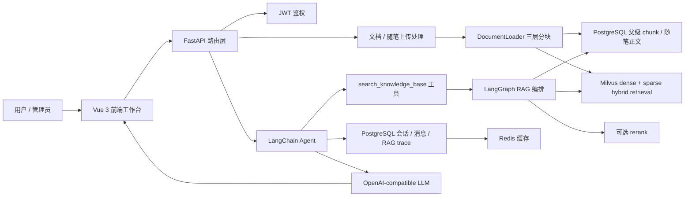

# MindMirror

MindMirror 是一个面向心理学、哲学与个人反思场景的 AI RAG 工作台。它把公共知识库、用户私密随笔、混合检索、流式对话、引用追踪和洞察时间线放在同一个应用里，适合作为后端 / 全栈 / AI 应用开发实习作品展示。

前端产品名为 `PsycheArchive`，后端项目与 API 名称保留为 `MindMirror`。

## 项目简介

MindMirror 解决的是“如何让 AI 基于资料和个人文字做更可靠的自我分析”：

- 管理员上传心理学、哲学、阅读笔记等公共资料，形成所有用户可用的知识库。
- 用户上传自己的随笔、反思、Markdown 日志或文档，系统按账号隔离为私密语料。
- 对话时 Agent 会按需要调用 RAG 工具，把用户随笔和公共知识库组合成回答依据。
- 前端展示会话历史、RAG trace、引用片段、洞察统计和时间线，形成可持续更新的个人反思档案。

这个项目不是简单的聊天壳，而是一个完整的 RAG 应用闭环：上传、解析、分块、索引、检索、重排、生成、追踪、持久化和前端可视化。

## 技术栈

- 前端：Vue 3 CDN 单页应用、原生 CSS、Marked、DOMPurify、Highlight.js
- 后端：FastAPI、Pydantic、SQLAlchemy、JWT 鉴权
- AI 编排：LangChain、LangGraph、OpenAI-compatible model API
- 检索：Milvus、dense + sparse hybrid retrieval、BM25 稀疏统计、可选 rerank
- 数据：PostgreSQL、Redis、本地上传文件存储
- 工程：Docker Compose、uv、模块化路由与本地静态前端

## 核心功能

- 用户体系：注册 / 登录 / JWT 鉴权，支持普通用户和管理员角色。
- 公共知识库：管理员上传 PDF、Word、Excel、Markdown 文档，系统解析后写入向量库。
- 私密随笔：用户上传个人反思文本，正文保存到 PostgreSQL，检索分块写入独立向量集合。
- 双通道 RAG：同一次问题可同时检索当前用户私密随笔和公共知识库，但不会跨用户泄漏数据。
- 流式对话：前端通过 SSE 接收模型输出和 RAG 检索步骤，用户能看到回答生成过程。
- 会话管理：保存历史对话、会话标题、绑定随笔和 RAG trace，支持继续会话与删除会话。
- 洞察视图：聚合随笔、会话和公共文档活动，展示主题、统计和连续时间线。
- 安全基础：上传文件名路径校验、Markdown 渲染净化、CORS 配置、JWT secret 环境化。

## 架构图



## 工程亮点

- 路由模块化：认证、活动、聊天、随笔、文档路由按领域拆分，入口 `backend/api.py` 只做聚合。
- 私密语料隔离：Milvus filter、chunk metadata 和 PostgreSQL 查询都带 `visibility / owner_id / document_domain`。
- 分层 chunk 与 auto-merging：L3 叶子 chunk 用于召回，必要时回溯 L1/L2 父块补足上下文。
- 混合检索：密集向量召回语义相似内容，BM25 稀疏向量增强关键词命中，再用 RRF 融合排序。
- 可观测 RAG：前端能展示检索阶段、扩展查询、rerank 信息、引用片段和最终 trace。
- 面向演示的前端：包含知识库、随笔档案、AI 探索、洞察、时间线和设置等完整工作台视图。
- 前端采用深色导航轨道与浅色阅读画布，兼顾长时间阅读、引用检查和多视图切换。

## 目录结构

```text
MindMirror/
├── backend/
│   ├── app.py                 # FastAPI 应用入口，挂载 CORS、路由和前端静态文件
│   ├── api.py                 # API router 聚合出口
│   ├── api_context.py         # 路由共享依赖、上传处理、SSE 工具和 Milvus 作用域过滤
│   ├── routes/                # 按领域拆分的 HTTP 路由
│   ├── agent.py               # LangChain Agent、会话存储和流式输出
│   ├── rag_pipeline.py        # LangGraph RAG 编排
│   ├── rag_utils.py           # 检索、rerank、auto-merging 和 query expansion
│   ├── document_loader.py     # PDF / Word / Excel / Markdown 解析与分块
│   ├── milvus_client.py       # Milvus collection、索引、查询和混合检索封装
│   ├── models.py              # SQLAlchemy 数据模型
│   └── schemas.py             # FastAPI 请求 / 响应模型
├── frontend/
│   ├── index.html             # Vue CDN 单页应用模板
│   ├── script.js              # 前端状态、API 调用、SSE 解析和交互逻辑
│   └── style.css              # 工作台视觉系统和响应式布局
├── docker-compose.yml         # PostgreSQL、Redis、Milvus、MinIO、etcd、Attu
├── pyproject.toml             # Python 依赖与开发依赖
└── .env.example               # 本地环境变量模板
```

## 本地部署

### 1) 环境准备

- Python `3.12+`
- `uv` 包管理器
- Docker / Docker Compose
- 一个兼容 OpenAI Chat Completions 的模型服务，例如 DashScope 兼容模式

### 2) 安装依赖

```bash
uv sync --group dev
```

如果不用 `uv`，也可以使用 pip：

```bash
python -m venv .venv
source .venv/bin/activate
pip install -U pip
pip install -e .
```

### 3) 创建 `.env`

复制模板：

```bash
cp .env.example .env
```

最少需要确认这些变量：

| 变量 | 说明 |
| --- | --- |
| `ARK_API_KEY` | 模型 API Key |
| `MODEL` | 主对话模型 |
| `GRADE_MODEL` | RAG 相关性评分模型，可用轻量模型 |
| `FAST_MODEL` | 快速任务模型，供部分辅助功能使用 |
| `BASE_URL` | OpenAI-compatible API 地址 |
| `EMBEDDING_MODEL` | 本地 embedding 模型，默认 `BAAI/bge-m3` |
| `DENSE_EMBEDDING_DIM` | 稠密向量维度，`BAAI/bge-m3` 默认为 `1024` |
| `RERANK_MODEL` | 可选 rerank 模型，不配置时自动降级 |
| `DATABASE_URL` | PostgreSQL 连接串 |
| `REDIS_URL` | Redis 连接串 |
| `REDIS_KEY_PREFIX` | Redis key 前缀，避免和本机其他项目冲突 |
| `REDIS_CACHE_TTL_SECONDS` | 会话、列表等缓存的默认 TTL |
| `JWT_SECRET_KEY` | JWT 签名密钥，生产环境必须换成强随机值 |
| `ADMIN_INVITE_CODE` | 注册管理员账号时需要的邀请码 |
| `HOST` / `PORT` | 后端监听地址和端口 |
| `CORS_ORIGINS` | 允许访问 API 的前端源，多个地址用逗号分隔 |
| `BM25_STATE_PATH` | BM25 稀疏统计持久化文件路径 |

### 4) 启动基础服务

```bash
docker compose up -d
docker compose ps
```

默认端口：

| 服务 | 端口 |
| --- | --- |
| PostgreSQL | `5432` |
| Redis | `6379` |
| Milvus | `19530` |
| Milvus health | `9091` |
| MinIO API | `9000` |
| MinIO Console | `9001` |
| Attu | `8080` |

### 5) 启动应用

```bash
uv run python -m uvicorn app:app --app-dir backend --host 0.0.0.0 --port 8000 --reload
```

访问：

- 前端页面：`http://127.0.0.1:8000/`
- API 文档：`http://127.0.0.1:8000/docs`
- Attu 向量库管理界面：`http://127.0.0.1:8080/`

## 使用流程

1. 打开前端页面，注册普通用户或使用管理员邀请码注册管理员。
2. 管理员进入知识库页面，上传公共资料。
3. 普通用户进入随笔档案，上传个人反思、随笔或 Markdown 日志。
4. 在 AI 探索页面提问，或从某篇随笔直接发起分析。
5. 查看回答下方引用、RAG trace、洞察面板和时间线。

## 界面方向

当前前端采用 `Immersive Focus` 视觉系统：

- 未登录页使用深石墨功能轨道与大面积白色表单画布
- 登录后沿用深色侧栏，把阅读、对话、知识库和洞察放在安静的浅色主画布中
- 界面令牌集中维护在 `frontend/style.css`
- 登录、注册、语言切换、导航、上传、会话、引用和设置交互保持完整

## 安全与边界

- 上传文件名会拒绝路径穿越和嵌套路径，只允许 PDF、Word、Excel、Markdown。
- 私密随笔通过用户 ID 参与向量过滤和数据库查询，避免不同用户间互相召回。
- 前端 Markdown 渲染使用 DOMPurify 净化，降低 XSS 风险。
- JWT、管理员邀请码、模型 Key 都通过环境变量配置，不应提交真实密钥。
- AI 输出用于自我探索和学习展示，不构成临床诊断或治疗建议。

## 后续可扩展方向

- 增加异步任务队列，把大文件解析和向量写入从请求线程中拆出。
- 增加文档上传大小限制、文件 hash 去重和索引任务重试。
- 为 RAG trace 增加可下载调试报告，方便面试或线上排障展示。
- 接入对象存储替代本地上传目录，便于多实例部署。
- 增加可选的浏览器端 E2E 验证流程，覆盖登录、上传、聊天和删除。
