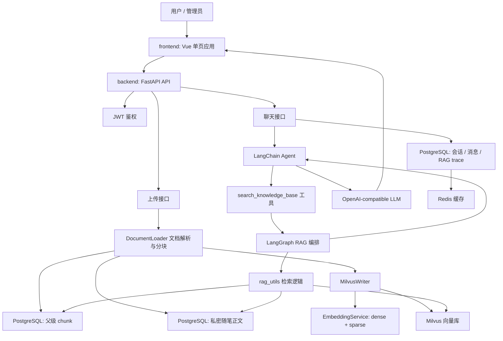
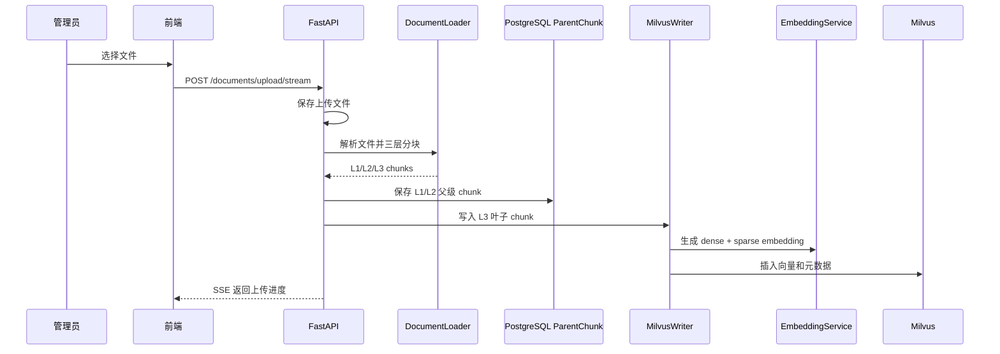
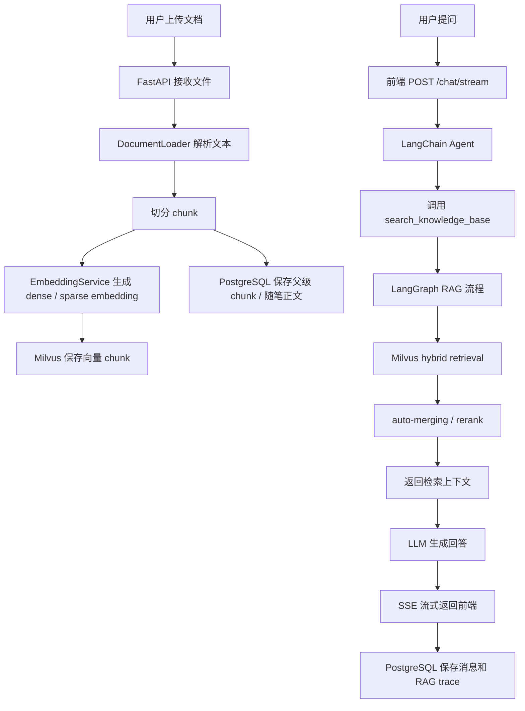

# MindMirror RAG 项目零基础拆解与实习面试指南

这份文档是给“刚开始学 RAG 项目的人”看的。你不需要先假装自己懂。你只要按顺序读，把每一层的职责搞清楚，就能慢慢把整个项目串起来。

先说一句：不要骂自己。RAG 项目本来就同时涉及前端、后端、数据库、向量数据库、文档解析、embedding、Agent、流式响应和测试。你觉得乱，是因为它确实是一个完整工程，不是一个只有几十行代码的小 demo。

## 0. 你先记住一句话

MindMirror 做的事情是：

> 用户上传资料和自己的随笔，系统把它们切成小块并写入向量库；聊天时，AI 先去向量库找相关内容，再基于找到的内容回答，并把检索证据展示给用户。

这就是 RAG。

RAG 的全称是 Retrieval-Augmented Generation，中文可以理解为：

> 检索增强生成。

普通 AI 聊天是：

```text
用户问题 -> 大模型 -> 回答
```

RAG 聊天是：

```text
用户问题 -> 先查资料 -> 把资料交给大模型 -> 回答
```

所以 RAG 的核心不是“让 AI 更聪明”，而是“让 AI 回答前先看你给它的资料”。

## 1. 用图书馆理解这个项目

你可以把 MindMirror 想成一个图书馆加一个助理：

- 公共知识库：图书馆公共书架，管理员放书。
- 私密随笔：每个用户自己的私人笔记本，别人看不到。
- DocumentLoader：把书拆成一页页、一段段、一小块。
- EmbeddingService：给每一小块内容生成“语义坐标”。
- Milvus：根据语义坐标快速找相似内容的向量数据库。
- PostgreSQL：保存用户、会话、随笔正文、父级 chunk 等结构化数据。
- Redis：缓存一些常用数据，让读取更快。
- LangChain Agent：会决定什么时候去查资料的 AI 助理。
- LangGraph RAG pipeline：检索流程编排器，负责初始检索、判断是否相关、必要时重写问题再检索。
- 前端 Vue：用户看到的工作台页面。

一句更工程化的话：

> 这个项目把“知识入库”和“聊天检索生成”拆成两条主链路。

## 2. 项目总架构



你暂时不需要记住每个文件，先记住两个主流程：

1. 上传资料时：文件 -> 解析 -> 分块 -> 向量化 -> 入库。
2. 用户聊天时：问题 -> 检索 -> 找资料 -> 大模型回答 -> 保存 trace。

## 3. 项目目录怎么读

重点文件如下：

```text
backend/
├── app.py                 # FastAPI 应用入口
├── api.py                 # 路由聚合
├── api_context.py         # 路由共享依赖、上传处理、SSE 工具
├── routes/
│   ├── auth.py            # 登录注册
│   ├── documents.py       # 公共知识库接口
│   ├── essays.py          # 私密随笔接口
│   ├── chat.py            # 聊天和会话接口
│   └── activity.py        # 洞察、时间线、每日一句
├── document_loader.py     # 文档解析和分块
├── embedding.py           # dense embedding + BM25 sparse embedding
├── milvus_client.py       # Milvus 集合、索引、查询、混合检索
├── milvus_writer.py       # 把 chunk 写入 Milvus
├── parent_chunk_store.py  # 父级 chunk 的 PostgreSQL 存储
├── essay_store.py         # 私密随笔正文存储
├── rag_utils.py           # RAG 检索核心逻辑
├── rag_pipeline.py        # LangGraph 编排
├── tools.py               # Agent 可调用的 search_knowledge_base 工具
├── agent.py               # LangChain Agent 和会话存储
├── models.py              # SQLAlchemy 数据表
└── schemas.py             # API 请求/响应模型

frontend/
├── index.html             # 页面结构
├── script.js              # Vue 状态、API 调用、SSE 流处理
└── style.css              # 样式
```

如果你只想快速理解 RAG，优先看这 6 个文件：

1. `backend/document_loader.py`
2. `backend/milvus_writer.py`
3. `backend/milvus_client.py`
4. `backend/rag_utils.py`
5. `backend/rag_pipeline.py`
6. `backend/agent.py`

## 4. 第一条主线：公共知识库如何入库

公共知识库是管理员上传的资料，比如 PDF、Word、Excel、Markdown。

接口位置：

```text
backend/routes/documents.py
```

核心接口：

```text
POST /documents/upload/stream
```

它最终调用：

```text
backend/api_context.py
_process_uploaded_document_sync(...)
```

完整流程如下：



### 4.1 为什么要分块

大模型不能一次性读完一本书，向量数据库也不是按“整本书”检索，而是按“小片段”检索。

所以必须把文档切成 chunk。

例如一篇文章：

```text
第一章：焦虑的来源
第二章：如何理解自我批评
第三章：行动和价值感
```

如果整篇文章作为一个向量，检索会很粗。

切成 chunk 后，用户问“自我批评怎么办”，系统可以找到第二章附近的片段。

### 4.2 这个项目为什么做三层 chunk

代码位置：

```text
backend/document_loader.py
_split_page_to_three_levels(...)
```

它不是只切一种大小，而是切三层：

```text
L1: 大块，语境完整
L2: 中块，承上启下
L3: 小块，适合精确召回
```

真正写入 Milvus 检索的是 L3。

L1 / L2 存 PostgreSQL，用于后续 auto-merging。

你可以这样理解：

```text
L3 像书里的一句话或一小段，适合快速命中。
L1/L2 像这句话所在的小节，适合补足上下文。
```

面试时可以说：

> 我没有只做固定长度切分，而是做了三层 chunk。叶子 chunk 用于召回，父级 chunk 用于召回后的上下文合并，减少回答时只拿到碎片化句子的情况。

## 5. 第二条主线：私密随笔如何入库

私密随笔是普通用户自己的反思、日记、Markdown 文件。

接口位置：

```text
backend/routes/essays.py
```

核心接口：

```text
POST /essays/upload/stream
```

它最终调用：

```text
backend/api_context.py
_process_uploaded_essay_sync(...)
```

私密随笔和公共知识库最大的区别是：

> 私密随笔必须按用户隔离。

所以每个私密 chunk 都带这些元数据：

```text
visibility = private
owner_id = 当前用户名
document_domain = essay
```

公共知识库则是：

```text
visibility = public
owner_id = ""
document_domain = knowledge_base
```

这三个字段非常重要。它们决定检索时能不能查到某个 chunk。

### 5.1 私密随笔保存在哪里

私密随笔有两份数据：

1. 完整正文保存到 PostgreSQL 的 `EssayDocument`。
2. 检索用 chunk 写入 Milvus。

为什么要两份？

因为 Milvus 擅长相似度检索，但不适合当业务数据库。

PostgreSQL 适合保存：

- 用户是谁
- 文件名
- 标题
- 完整正文
- 上传时间
- chunk 数量

Milvus 适合保存：

- chunk 文本
- dense 向量
- sparse 向量
- chunk 元数据

面试时可以说：

> 我把向量检索和业务状态分开存储。Milvus 负责召回，PostgreSQL 负责保存完整正文、用户关系和会话状态。

## 6. Embedding 是什么

Embedding 可以理解成“把文字变成数字坐标”。

比如：

```text
"焦虑" -> [0.12, -0.31, 0.88, ...]
"担心未来" -> [0.10, -0.29, 0.84, ...]
"苹果手机" -> [-0.77, 0.02, 0.13, ...]
```

语义接近的文本，向量距离更近。

所以用户问“我总是担心未来怎么办”，系统可以找到包含“焦虑、预期性担忧、不确定性”的 chunk。

代码位置：

```text
backend/embedding.py
EmbeddingService
```

这个项目有两种 embedding：

### 6.1 Dense embedding

Dense embedding 是常规语义向量。

优点：

- 能理解语义相似。
- “焦虑”和“担心未来”可能会靠得很近。

缺点：

- 对精确关键词、标题、人名、术语不一定稳定。

### 6.2 Sparse embedding

Sparse embedding 在这个项目里主要来自 BM25。

BM25 更像关键词检索。

优点：

- 精确词命中强。
- 文件标题、专业术语、关键词更容易找。

缺点：

- 不太懂语义相似。

### 6.3 为什么 dense + sparse 一起用

因为它们互补。

用户问题：

```text
请分析《拖延与自责》这篇随笔
```

Dense 可能理解“拖延、自责”的语义。

Sparse 更容易命中文件名或标题里的“拖延与自责”。

所以项目用了 hybrid retrieval：

```text
dense 检索 + sparse 检索 -> RRF 融合排序
```

面试时可以说：

> Dense 负责语义召回，Sparse 负责关键词和精确标题召回。我用 Milvus hybrid search 做双路检索，再用 RRF 融合结果。

## 7. Milvus 在这里做什么

Milvus 是向量数据库。

它负责：

1. 存 chunk 的向量。
2. 根据用户问题向量找相似 chunk。
3. 根据 filter 限制只能查公共知识库或当前用户私密随笔。

代码位置：

```text
backend/milvus_client.py
MilvusManager
```

集合里主要字段：

```text
dense_embedding
sparse_embedding
text
filename
file_type
page_number
chunk_id
parent_chunk_id
root_chunk_id
chunk_level
visibility
owner_id
document_domain
```

你可以把每条 Milvus 数据理解成：

```json
{
  "text": "这是一段文档内容",
  "dense_embedding": [0.1, 0.2, "..."],
  "sparse_embedding": {"123": 0.88},
  "filename": "psychology.md",
  "chunk_id": "psychology.md::p0::l3::1",
  "parent_chunk_id": "psychology.md::p0::l2::0",
  "visibility": "public",
  "owner_id": "",
  "document_domain": "knowledge_base"
}
```

## 8. RAG 检索核心逻辑

最核心文件：

```text
backend/rag_utils.py
```

最核心函数：

```text
retrieve_documents(...)
```

它做的事情可以拆成 7 步。

### 8.1 构造检索作用域

如果当前用户是 `alice`，那么检索范围是：

```text
公共知识库
OR
alice 自己的私密随笔
```

不会查到 `bob` 的私密随笔。

这就是多用户 RAG 项目最容易被问到的点：

> 你怎么避免用户 A 检索到用户 B 的私密资料？

回答：

> chunk 写入时带 owner_id、visibility 和 document_domain。检索时 Milvus filter 强制限制 owner_id 为当前用户，公共资料和私密资料分域过滤。

### 8.2 优先处理用户点名的随笔

如果用户问：

```text
帮我分析《最近的低落》这篇随笔
```

系统会先从问题里提取标题。

相关函数：

```text
_extract_requested_titles(...)
```

这一步能避免一个尴尬情况：

> 用户明明点名了某篇随笔，但向量召回没召到。

所以项目做了标题匹配兜底。

### 8.3 会话绑定随笔

前端支持从某篇随笔直接进入 AI 分析。

这时请求会带：

```text
active_essay_id
active_essay_title
analysis_mode = essay
```

后端会优先使用当前绑定随笔。

这样用户点了某篇随笔后，后续连续追问还能围绕这篇随笔展开。

### 8.4 检索私密随笔

私密随笔检索有两种：

1. 精确标题 / ID 命中。
2. 语义向量召回。

如果找到私密随笔，会在 trace 里标记 `essay_context`。

### 8.5 检索公共知识库

公共知识库只查：

```text
visibility == public
document_domain == knowledge_base
```

它用 hybrid retrieval：

```text
dense_embedding + sparse_embedding
```

### 8.6 Auto-merging

如果检索命中了多个同一个父块下面的 L3 chunk，系统会认为：

> 这一小节整体可能都相关。

于是回溯父块，把更完整的 L1/L2 内容拿出来。

这叫 auto-merging。

为什么有用？

因为只拿 L3 小块可能太碎。

例如召回到：

```text
"这其实是一种防御机制。"
```

这句话单独看没意义。

回到父块后可能变成：

```text
"当一个人反复拖延时，这不一定只是懒惰，也可能是一种防御机制。它暂时避免了面对失败评价的痛苦。"
```

回答质量会更好。

### 8.7 Rerank

初步检索后，如果配置了 rerank 模型，系统会重新给候选文档排序。

粗略理解：

```text
Milvus 先找一批可能相关的
rerank 再从这批里面挑更相关的
```

面试时可以说：

> 初召回追求覆盖率，rerank 追求排序质量。

## 9. LangGraph 做了什么

文件：

```text
backend/rag_pipeline.py
```

这个项目不是直接：

```text
用户问题 -> retrieve_documents -> 回答
```

而是用 LangGraph 做了一个状态机：

```text
retrieve_initial
    -> grade_documents
        -> 如果相关：结束，交给 Agent 回答
        -> 如果不相关：rewrite_question
            -> retrieve_expanded
```

### 9.1 retrieve_initial

用用户原问题先检索。

比如：

```text
我为什么总是拖延？
```

先直接去查。

### 9.2 grade_documents

让模型判断检索结果是否相关。

如果相关，就继续回答。

如果不相关，就进入问题重写。

### 9.3 rewrite_question

系统会选择扩展策略：

- `step_back`：退一步问更通用的问题。
- `hyde`：生成一个假想答案文档，再用这个文档检索。
- `complex`：复杂问题，两种策略都可能用。

### 9.4 retrieve_expanded

用扩展后的 query 再检索一次。

这个设计的意义是：

> 当用户问题太抽象或第一次没搜好时，不直接放弃，而是尝试换一种检索方式。

面试时可以说：

> 我用 LangGraph 把 RAG 拆成可观测节点，包括初始检索、相关性评分、查询重写和扩展检索。这样比单函数链路更容易调试，也能把每个阶段写进 trace。

## 10. Agent 和工具调用

文件：

```text
backend/agent.py
backend/tools.py
```

Agent 创建时注册了工具：

```text
search_knowledge_base
```

这个工具内部会调用 LangGraph RAG 流程。

你可以理解成：

```text
Agent 是大脑
search_knowledge_base 是它的查资料能力
rag_pipeline 是查资料的流程
rag_utils 是真正查资料的底层实现
```

### 10.1 为什么要用工具

因为大模型本身不知道用户上传了什么。

所以当用户问：

```text
分析我上传的那篇《拖延和自责》
```

Agent 必须调用工具去查。

系统提示词里明确要求：

> 如果用户提到具体上传随笔、反思标题、个人写作，就必须调用 search_knowledge_base。

这能减少模型胡说。

## 11. RAG trace 是什么

RAG trace 是一次回答背后的检索记录。

它可能包含：

```text
tool_used
query
expanded_query
retrieved_chunks
rerank_enabled
rerank_applied
retrieval_mode
essay_context
knowledge_context
auto_merge_applied
```

它的作用：

1. 前端展示引用。
2. 开发时调试检索效果。
3. 面试时展示项目不是黑盒。
4. 用户能知道 AI 参考了哪些资料。

模型回答不是凭空来的，而是有证据链。

## 12. 前端怎么接收流式回答

文件：

```text
frontend/script.js
```

聊天请求接口：

```text
POST /chat/stream
```

前端通过 SSE 接收后端流式数据。

SSE 可以理解成：

> 后端一边生成，一边把小消息推给前端。

可能收到这些事件：

```json
{"type": "content", "content": "我理解你的感受..."}
{"type": "rag_step", "step": {"label": "正在检索知识库"}}
{"type": "trace", "rag_trace": {...}}
{"type": "error", "content": "出错信息"}
```

前端统一用：

```text
consumeSseMessages(...)
```

来解析这些事件。

## 13. 上传为什么也用 SSE

因为上传和索引不是瞬间完成的。

用户上传一个 PDF 后，后端要：

1. 接收文件。
2. 解析文本。
3. 切 chunk。
4. 生成 embedding。
5. 写 Milvus。
6. 保存父块和封面。

如果没有进度，用户会以为卡住了。

所以上传接口也返回 SSE，让前端显示：

```text
正在接收文件
正在解析
正在分块
正在向量化
写入完成
```

这属于产品体验上的工程细节。

## 14. PostgreSQL、Redis、Milvus 各自负责什么

### PostgreSQL

负责业务数据：

- 用户
- 会话
- 消息
- RAG trace
- 私密随笔正文
- 父级 chunk

### Redis

负责缓存：

- 会话列表
- 会话消息
- 其他短期 JSON 数据

它不是必须保存永久数据，主要为了加速。

### Milvus

负责向量检索：

- chunk 向量
- chunk 文本
- chunk 元数据
- hybrid search

一句话：

```text
PostgreSQL 管业务状态
Redis 管缓存
Milvus 管相似度检索
```

## 15. 你应该怎么学习这个项目

不要一上来从 `agent.py` 读到崩溃。

建议按这个顺序：

### 第一天：搞懂入库

读：

```text
backend/routes/documents.py
backend/routes/essays.py
backend/api_context.py
backend/document_loader.py
backend/milvus_writer.py
```

你要回答出：

1. 上传接口在哪里？
2. 文件保存在哪里？
3. 文档如何解析？
4. chunk 如何生成？
5. chunk 写到哪里？
6. 公共知识库和私密随笔有什么区别？

### 第二天：搞懂检索

读：

```text
backend/embedding.py
backend/milvus_client.py
backend/rag_utils.py
```

你要回答出：

1. dense embedding 是什么？
2. sparse embedding 是什么？
3. hybrid retrieval 怎么做？
4. filter 如何保证私密隔离？
5. auto-merging 为什么有用？
6. rerank 为什么是可选的？

### 第三天：搞懂聊天

读：

```text
backend/rag_pipeline.py
backend/tools.py
backend/agent.py
frontend/script.js
```

你要回答出：

1. Agent 什么时候调用工具？
2. LangGraph 有哪些节点？
3. RAG trace 怎么产生？
4. 前端怎么接收流式回答？
5. 会话怎么保存？

## 16. 面试时怎么讲

### 16.1 30 秒版本

> MindMirror 是一个面向个人反思场景的双通道 RAG 工作台。管理员可以上传公共心理学和哲学资料，用户可以上传自己的私密随笔。系统会解析文档、三层分块、生成 dense 和 sparse embedding，并写入 Milvus。聊天时 LangChain Agent 调用 RAG 工具，LangGraph 编排初始检索、相关性评分、查询重写和扩展检索，最后把检索片段和 RAG trace 流式返回前端。

### 16.2 1 分钟版本

> 这个项目分成入库和检索生成两条链路。入库时，公共文档和私密随笔都会经过 DocumentLoader 解析和分块；公共知识库使用三层 chunk，叶子块写 Milvus，父级块存 PostgreSQL，方便 auto-merging；私密随笔保存完整正文，并用 owner_id 做检索隔离。检索时，我用 Milvus 的 dense + sparse hybrid retrieval，dense 负责语义召回，sparse 负责关键词和标题命中，再用 RRF 融合，必要时接 rerank。Agent 层通过 search_knowledge_base 工具调用 LangGraph RAG 流程，前端用 SSE 展示流式回答和检索 trace。

### 16.3 简历 bullet

可以写：

- 设计并实现基于 FastAPI、LangChain、LangGraph 和 Milvus 的双通道 RAG 系统，支持公共知识库与用户私密随笔隔离检索。
- 实现 PDF、Word、Excel、Markdown 文档解析、三层 chunk、父子 chunk 存储、dense + sparse hybrid retrieval 和 RRF 融合排序。
- 基于 PostgreSQL 保存用户、会话、私密随笔正文、父级 chunk 和 RAG trace，使用 Redis 缓存会话消息和列表。
- 实现基于 SSE 的流式对话和上传进度展示，前端可查看引用片段、检索阶段、rerank 信息和回答证据链。
- 通过接口与页面验收覆盖上传安全、API 合约、Milvus 检索、私密作用域、Markdown 安全和前端布局。

## 17. 面试官可能问什么

### 问：为什么不用普通关键词搜索？

答：

> 关键词搜索只能匹配表面词，不能很好理解语义。比如“焦虑”和“总是担心未来”语义接近但字面不同。向量检索能做语义召回，所以更适合 RAG。但关键词对标题和术语更稳定，所以我用了 dense + sparse hybrid retrieval。

### 问：为什么要 Milvus？

答：

> 因为文档被切成很多 chunk 后，需要根据向量相似度快速召回。普通 PostgreSQL 不适合高维向量相似度检索，所以用 Milvus 存 dense 和 sparse embedding，并支持 hybrid search。

### 问：为什么还要 PostgreSQL？

答：

> Milvus 负责检索，不适合管理业务关系。用户、会话、消息、私密随笔正文、父级 chunk 和 trace 都是结构化业务数据，所以放在 PostgreSQL。

### 问：怎么保证私密随笔不泄漏？

答：

> 写入每个私密 chunk 时带 owner_id、visibility 和 document_domain。检索时根据当前登录用户构造 Milvus filter，只允许查 public 知识库和当前用户自己的 private essay。PostgreSQL 查询也按 owner_id 限制。

### 问：为什么要三层 chunk？

答：

> 小 chunk 精确但语境不足，大 chunk 语境完整但召回不精确。所以我用 L3 小块做召回，L1/L2 父块做 auto-merging。当多个叶子块命中同一父块时，回溯父块补全上下文。

### 问：LangGraph 有什么用？

答：

> 它把 RAG 过程拆成节点，比如初始检索、相关性评分、查询重写、扩展检索。这样每一步都能单独调试，也方便把过程写进 RAG trace。

### 问：RAG trace 有什么价值？

答：

> 它能展示模型参考了哪些 chunk、是否 rerank、是否 auto-merge、检索 query 是什么。对用户是可信度展示，对开发者是调试工具，对面试展示也很直观。

## 18. 你可以继续改进的方向

这些适合作为后续实习作品优化点：

1. 加异步任务队列：大文件解析和 embedding 写入放到后台任务。
2. 加文档 hash 去重：同一个文件重复上传时避免重复索引。
3. 加更完整的权限测试：验证用户 A 永远查不到用户 B 的随笔。
4. 加 RAG 评测脚本：用固定问题集评估召回质量。
5. 加浏览器端 E2E 测试：覆盖登录、上传、聊天、删除。
6. 加检索参数面板：在前端调整 top_k、rerank、auto_merge_threshold。

## 19. 最后给你一张总流程图



你以后讲这个项目时，脑子里就放这句话：

> 入库时把资料变成可检索的 chunk；聊天时先查相关 chunk，再让大模型基于证据回答。

这句话就是整个 RAG 项目的骨架。
